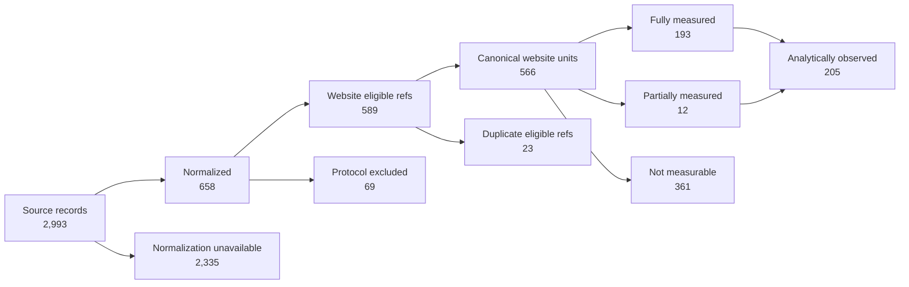

# IPB measurement-attrition result — 2026-10-05 full-population run

Analysis: `measurement-attrition/1.0.0-reconstruction`

## Frozen provenance

- ResearchRun: `01a10a29-cf8d-7711-8e6d-ec954e592cc2`
- GitHub Actions workflow run: `37260583969`
- preserved workflow artifact: `ipb-full-validation` (artifact `11324489250`)
- artifact digest: `sha256:fec211aa0a9ab0898123e1c4f7018810d116e0a572784a5abbcfd925736620a2`
- run Git commit: `fa276f203ba6d95bfb0270b7fdfd71047d1c47f1`
- source dataset SHA-256: `094e991b22293d78a11bc18ec2fb191d612b66ecad65145466d22108db4bf022`
- preserved `population-results.json` SHA-256: `b5e5e438aae281c764ddb469b3089efb81e3d3aa7816676c7df9ba44789fe23e`
- canonicalized derived per-source attrition-row SHA-256: `3f99fa50061acd478e0d6347d8440f0c7522dd6d8f63694e992345b996fefaf3`
- protocol: `0.1.0-draft`

## Why this is a reconstruction

The preserved October 5 workflow artifact predates the dedicated `attrition-results.json`, `attrition-summary.json` and `attrition-flow.md` outputs introduced later by #215.

The artifact nevertheless preserves all 2,993 rows in `population-results.json`. This result applies the current `RunExporter` attrition rules to those frozen rows. No source record is added, dropped or recollected, and no live-Web request is made.

The derived per-source rows are not duplicated into the public repository. Their deterministic canonical JSON hash is recorded above, while the preserved source artifact and the transformation rule provide the reproducibility path.

## Population flow

| Stage / terminal state | Count | Relevant denominator | Rate |
| --- | ---: | ---: | ---: |
| source population | 2,993 | 2,993 | 100.00% |
| normalized resources | 658 | 2,993 | 21.98% |
| normalization unavailable | 2,335 | 2,993 | 78.02% |
| website-measurement eligible | 589 | 2,993 | 19.68% |
| protocol-excluded after normalization | 69 | 658 | 10.49% |
| canonical website units | 566 | 589 eligible refs | 96.10% |
| duplicate eligible references | 23 | 589 eligible refs | 3.90% |
| fully measured canonical units | 193 | 566 | 34.10% |
| partially measured canonical units | 12 | 566 | 2.12% |
| analytically observed canonical units | 205 | 566 | 36.22% |
| not measurable canonical units | 361 | 566 | 63.78% |
| missing outcome canonical units | 0 | 566 | 0.00% |

The most important denominator change occurs before acquisition: only 658 of 2,993 declared source records normalize to a URL under the preserved source/protocol state. Among the 589 eligible references, deduplication yields 566 canonical website measurement units. Of those canonical units, 205 are analytically observable and 361 are not measurable.

This flow describes the study instrument and source population. It does not imply that the 2,335 normalization-unavailable source rows correspond to defective organizations or websites; many source records simply do not declare a usable web resource.

## Reconciliation

All 2,993 source records terminate in exactly one declared attrition category:

```text
2,335 normalization_unavailable
+ 69 protocol_excluded
+ 23 duplicate_eligible_reference
+ 193 fully_measured
+ 12 partially_measured
+ 361 not_measurable
= 2,993 source records
```

Canonical outcomes also reconcile:

```text
193 fully_measured
+ 12 partially_measured
+ 361 not_measurable
= 566 canonical website units
```

There are no `missing_outcome` canonical units in this frozen run.

## Reproducible flow figure



## Canonical measurement-loss reasons

The 361 non-measurable canonical units reconcile to the following primary reasons:

| Reason | Count |
| --- | ---: |
| DNS failure | 228 |
| anti-bot challenge | 47 |
| HTTP 429 | 34 |
| HTTP 404 | 13 |
| TLS failure | 11 |
| no successful document | 7 |
| HTTP 403 | 5 |
| HTTP 500 | 4 |
| timeout | 4 |
| private network | 2 |
| empty HTML content | 1 |
| HTTP 401 | 1 |
| HTTP 410 | 1 |
| redirected to link aggregator | 1 |
| redirected to social network | 1 |
| redirected to video platform | 1 |

These are terminal primary reasons from the frozen run, not causal claims about the organizations.

## RQ1 interpretation

For this IPB observation, measurement attrition is substantial and occurs at multiple semantically distinct stages.

The strongest result is not merely that 36.22% of canonical website units were observable. The source population, normalized-resource population, eligible-reference population, canonical website population and analytically observed population are materially different denominators. Collapsing those stages would hide whether loss came from absent/unusable declarations, protocol exclusions, duplicate references or failed acquisition.

This result supports P1 for the studied run in the narrow sense that the transformation from declared population to analytical population is empirically non-trivial and requires explicit provenance.

It does **not** establish that the same attrition pattern holds for another population or another observation date.

## Machine-readable outputs

- `ipb-2026-10-05-attrition-summary.json`
- `ipb-2026-10-05-attrition-flow.csv`

The complete source-level reconstruction remains reproducible from the preserved `population-results.json` artifact and the current `RunExporter` rules; the canonicalized derived-row hash is recorded to detect reconstruction drift.
